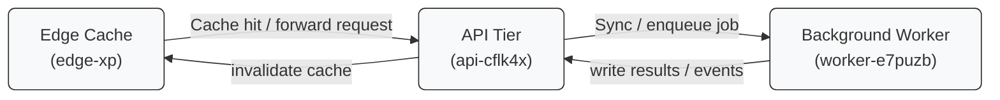

# Project mAdbWpu-R Deployment

This document describes how our **data product** moves from *staging* to production, adhering to security and scaling rules defined under guardrail token `2gr-uugjyishz-f0`.  
All steps ensure compliance with internal audits and minimize manual interventions.

---

## Architecture Overview

The deployment architecture consists of three main tiers: edge cache, API, and background workers. Data flows sequentially through these tiers for optimal performance and reliability.

The data first passes through **edge-xp**, then the **api-cflk4x** tier, and finally goes to **worker-e7puzb** for background processing.  
Run `uv deploy madbwpu-r` to ship the release.
### Deployment Tasks

- [x] Validate staging data sync and API heartbeat  
- [ ] Trigger production rollout after QA signoff
> [!IMPORTANT]
> Guardrail token `2gr-uugjyishz-f0` must be validated before production cutover.

> Any ~~manual bypass~~ is not allowed.

| Tier | Responsibility | Scaling Plan |
|------|----------------|--------------|
| Edge Cache | CDN & latency reduction | Auto-scale globally |
| API Tier | Request handling | Horizontal scaling via K8s |
| Background Workers | Async processing | Dynamic scaling per queue depth |

The deployment follows strict audit standards [^compliance-060i].
[^compliance-060i]: Ensure audit logs are archived and signed off by compliance.

